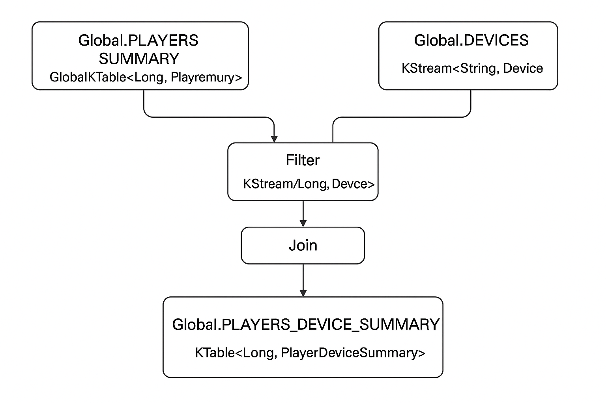
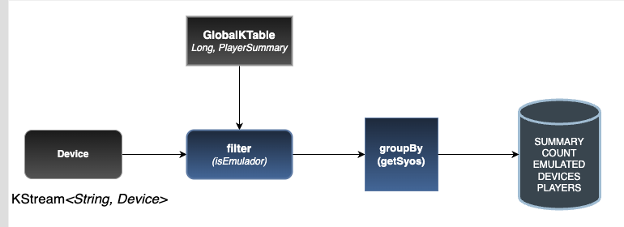

# 🎯 Streaming Engine - Event Processing com Quarkus + Kafka Streams

[](https://www.oracle.com/java/)
[](https://quarkus.io)
[](https://kafka.apache.org/documentation/streams/)
[](https://maven.apache.org/)
[](LICENSE)

> ## [Consumidor e Produtor com Broadcats. Tópico Player como ingestão de dados através do AWS Database Migration Service.](/https://www.linkedin.com/in/rian-vasconcelos-83350929/)


---


## 🔍 Visão Geral

Este projeto demonstra como construir pipelines de **stream processing** com **Kafka Streams** e **Quarkus**, realizando:

- **Joins** entre dispositivos e jogadores
- **Agrupamentos e agregações**
- **Materialização de estado**
- Produção contínua de eventos para novos tópicos Kafka

---

## 🧠 Conceitos em Destaque

| Conceito        | Descrição |
|-----------------|-----------|
| **KStream**     | Fluxo contínuo de registros do Kafka. Ideal para eventos mutáveis e em tempo real. |
| **KTable**      | Representa o estado atual derivado de um fluxo. Útil para agregações. |
| **GlobalKTable**| Tabela replicada em todas as instâncias do app. Boa para joins globais. |
| **Materialized**| Define como o estado é armazenado localmente (com TTL, serdes, etc). |

---

## 📁 Estrutura do Projeto
```bash
Streaming-Engine/
├── observer-player-device/       # Serviço principal de processamento
├── consumer-producer-player/     # Produtor e consumidor de eventos de jogadores
├── observer-device-count/        # Agregações por tipo de dispositivos de jogadores
├── docker-compose-kafka.yaml     # Configuração do ambiente Kafka
├── Help.txt                      # Comandos úteis para setup e execução
└── README.md                     # Documentação do projeto

```
---

## ⚙️ Configuração e Execução

### Pré-requisitos

- Java 17+
- Apache Maven 3.9.9+
- Docker + Docker Compose

### 🚀 Rodando localmente

```bash
# Clone o repositório
git clone https://github.com/rianmachado/Streaming-Engine.git
cd Streaming-Engine

# Criando imagens Docker
docker build -f Dockerfile.native  -t {SEU_DOCKER_HUB}/consumer-producer-player:v01 --platform=linux/amd64,linux/arm64 .

docker build -f Dockerfile.native  -t {SEU_DOCKER_HUB}/observer-player-device:v01 --platform=linux/amd64,linux/arm64 .

docker build -f Dockerfile.native  -t {SEU_DOCKER_HUB}/observer-device-count:v01 --platform=linux/amd64,linux/arm64 .

docker build -f Dockerfile.native  -t {SEU_DOCKER_HUB}/observer-emmulator-count:v01 --platform=linux/amd64,linux/arm64 .

# Inicie o ambiente Kafka
docker-compose -f docker-compose-kafka.yaml up -d

# Execute os serviços
docker-compose -f consumer-producer-player.yaml up -d
docker-compose -f observer-player-device.yaml up -d
docker-compose -f observer-device-count.yaml up -d
docker-compose -f observer-emmulator-count.yaml up -d

```
## 🌐 Principais Topologias


### 🔄 Junção Player + Device
- Conecta eventos de dispositivos com perfis de jogador
- Usa KStream, GlobalKTable, join, e produz resumos enriquecidos

---
> ## Processor Topology Kafka Streams



---

### 📊 Agregações por Plataforma
- Agrupa dispositivos por sysos (ex: Android)
- Conta eventos por plataforma e materializa com TTL
- Usa groupBy, aggregate, e Materialized com retenção configurada

---
> ## Processor Topology Aggregator Count Kafka Streams



---

## 🧪 Testes
### 📌 Simule eventos utilizando ferramentas como kcat ou Kafka CLI.

```bash
kcat -b localhost:9092 -P -t devices
```

## 🧠 Conceitos Destacados
- KStream: Processamento de fluxos contínuos de dados.
- KTable: Representação de estado derivado de um fluxo.
- GlobalKTable: KTable replicado em todas as instâncias da aplicação.
- Materialized: Configuração de armazenamento de estado local, incluindo tempo de retenção e serialização.

## 📚 Recursos Recomendados
- Documentação Quarkus Kafka Streams
- Kafka Streams Developer Guide
- Guia Kafka com Quarkus

## 👨‍💻 Autor
- [Desenvolvido por Rian Machado](/https://www.linkedin.com/in/rian-vasconcelos-83350929/)
   
   Especialista em Arquitetura de Soluções | Apache Kafka | Quarkus | Streaming em Tempo Real